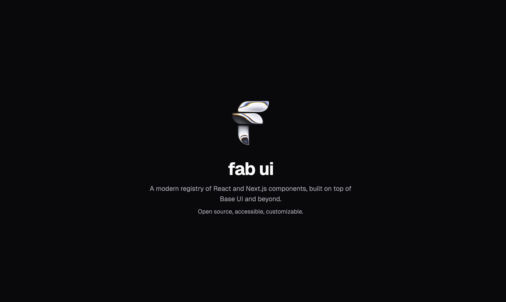

# fab ui

[](LICENSE)
[](https://github.com/kfirfitousi/fab-ui)

A modern registry of React and Next.js components, built on Base UI.
Open source, accessible, customizable.

[**Website**](https://fab-ui.com) · [**Documentation**](https://fab-ui.com/docs)

## Features

- **Built on Base UI** - Accessible, WCAG-compliant components
- **Own Your Code** - Copy into your project, no runtime dependencies
- **Modern Stack** - React 19, Tailwind CSS v4, TypeScript
- **39 Components** - Forms, dialogs, menus, and more
- **Liquid Metal Effects** - Unique animated shader components

## Quick Start

Install components directly into your project using the shadcn CLI:

```bash
npx shadcn@latest add https://fab-ui.com/r/button.json
```

Or configure the registry in your `components.json` for namespaced imports:

```json
{
  "registries": {
    "fab-ui": "https://fab-ui.com/r/{name}.json"
  }
}
```

Then add components:

```bash
npx shadcn@latest add fab-ui/button
```

## Components

| Category         | Components                                                                                                                                                  |
| ---------------- | ----------------------------------------------------------------------------------------------------------------------------------------------------------- |
| **Form**         | Button, Checkbox, Checkbox Group, Combobox, Field, Fieldset, Form, Input, Input Group, Label, Number Field, Radio, Select, Slider, Switch, Textarea, Toggle |
| **Overlay**      | Alert Dialog, Context Menu, Dialog, Dropdown Menu, Popover, Preview Card, Tooltip                                                                           |
| **Layout**       | Accordion, Card, Collapsible, Scroll Area, Separator, Tabs, Toolbar                                                                                         |
| **Data Display** | Avatar, Badge, Meter, Progress                                                                                                                              |
| **Special**      | Autocomplete, Toggle Group, Liquid Metal Button, Liquid Metal Avatar                                                                                        |

## Documentation

Full documentation available at [fab-ui.com/docs](https://fab-ui.com/docs)

## Built With

- [Base UI](https://base-ui.com) - Headless, accessible primitives
- [Tailwind CSS v4](https://tailwindcss.com) - Utility-first styling
- [Paper Design Shaders](https://github.com/paper-design/shaders) - Liquid metal effects

## License

MIT © 2025
